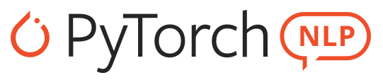

<p align="center"></p>

<h3 align="center">Supporting Rapid Prototyping with a Deep Learning NLP Toolkit&nbsp;&nbsp;
  <a href="https://twitter.com/intent/tweet?text=Supporting%20rapid%20prototyping%20for%20research,%20PyTorch-NLP%20has%20LAUNCHED,%20a%20deep%20learning%20natural%20language%20processing%20(NLP)%20toolkit!%20&url=https://github.com/PetrochukM/PyTorch-NLP&hashtags=pytorch,nlp,research">
    
  </a>
</h3>

PyTorch-NLP, or torchnlp for short, is a library of neural network layers, text processing modules and datasets designed to accelerate Natural Language Processing (NLP) research.

Join our community, add datasets and neural network layers! Chat with us on [Gitter](https://gitter.im/PyTorch-NLP/Lobby) and join the [Google Group](https://groups.google.com/forum/#!forum/pytorch-nlp), we're eager to collaborate with you.


[](https://codecov.io/gh/PetrochukM/PyTorch-NLP)
[](http://pepy.tech/project/pytorch-nlp)
[](http://pytorchnlp.readthedocs.io/en/latest/?badge=latest&style=flat-square)
[](https://travis-ci.org/PetrochukM/PyTorch-NLP)

_Logo by [Chloe Yeo](http://www.yeochloe.com/)_

## Installation

Make sure you have Python 3.6+ and PyTorch 1.0+. You can then install `pytorch-nlp` using
pip:

    pip install pytorch-nlp

Or to install the latest code via:

    pip install git+https://github.com/PetrochukM/PyTorch-NLP.git

## Docs 📖

The complete documentation for PyTorch-NLP is available via [our ReadTheDocs website](https://pytorchnlp.readthedocs.io).

## Basics

Add PyTorch-NLP to your project by following one of the common use cases:

### Load a [Dataset](http://pytorchnlp.readthedocs.io/en/latest/source/torchnlp.datasets.html)

Load the IMDB dataset, for example:

```python
from torchnlp.datasets import imdb_dataset

# Load the imdb training dataset
train = imdb_dataset(train=True)
train[0]  # RETURNS: {'text': 'For a movie that gets..', 'sentiment': 'pos'}
```

### Apply [Neural Networks](http://pytorchnlp.readthedocs.io/en/latest/source/torchnlp.nn.html) Layers

For example, from the neural network package, apply state-of-the-art LockedDropout:

```python
import torch
from torchnlp.nn import LockedDropout

input_ = torch.randn(6, 3, 10)
dropout = LockedDropout(0.5)

# Apply a LockedDropout to `input_`
dropout(input_) # RETURNS: torch.FloatTensor (6x3x10)
```

### [Encode Text](http://pytorchnlp.readthedocs.io/en/latest/source/torchnlp.encoders.text.html)

Tokenize and encode text as a tensor. For example, a `WhitespaceEncoder` breaks text into terms whenever it encounters a whitespace character.

```python
from torchnlp.encoders.text import WhitespaceEncoder

# Create a `WhitespaceEncoder` with a corpus of text
encoder = WhitespaceEncoder(["now this ain't funny", "so don't you dare laugh"])

# Encode and decode phrases
encoder.encode("this ain't funny.") # RETURNS: torch.Tensor([6, 7, 1])
encoder.decode(encoder.encode("This ain't funny.")) # RETURNS: "this ain't funny."
```

### Load [Word Vectors](http://pytorchnlp.readthedocs.io/en/latest/source/torchnlp.word_to_vector.html)

For example, load FastText, state-of-the-art English word vectors:

```python
from torchnlp.word_to_vector import FastText

vectors = FastText()
# Load vectors for any word as a `torch.FloatTensor`
vectors['hello']  # RETURNS: [torch.FloatTensor of size 100]
```

### Compute [Metrics](http://pytorchnlp.readthedocs.io/en/latest/source/torchnlp.metrics.html)

Finally, compute common metrics such as the BLEU score.

```python
from torchnlp.metrics import get_moses_multi_bleu

hypotheses = ["The brown fox jumps over the dog 笑"]
references = ["The quick brown fox jumps over the lazy dog 笑"]

# Compute BLEU score with the official BLEU perl script
get_moses_multi_bleu(hypotheses, references, lowercase=True)  # RETURNS: 47.9
```

### Help :question:

Maybe looking at longer examples may help you at [`examples/`](examples/).

Need more help? We are happy to answer your questions via [Gitter Chat](https://gitter.im/PyTorch-NLP)

## Contributing

We've released PyTorch-NLP because we found a lack of basic toolkits for NLP in PyTorch. We hope that other organizations can benefit from the project. We are thankful for any contributions from the community.

### Contributing Guide

Read our [contributing guide](https://github.com/PetrochukM/PyTorch-NLP/blob/master/CONTRIBUTING.md) to learn about our development process, how to propose bugfixes and improvements, and how to build and test your changes to PyTorch-NLP.

## Related Work

### [torchtext](https://github.com/pytorch/text)

torchtext and PyTorch-NLP differ in the architecture and feature set; otherwise, they are similar. torchtext and PyTorch-NLP provide pre-trained word vectors, datasets, iterators and text encoders. PyTorch-NLP also provides neural network modules and metrics. From an architecture standpoint, torchtext is object orientated with external coupling while PyTorch-NLP is object orientated with low coupling.

### [AllenNLP](https://github.com/allenai/allennlp)

AllenNLP is designed to be a platform for research. PyTorch-NLP is designed to be a lightweight toolkit.

## Authors

* [Michael Petrochuk](https://github.com/PetrochukM/) — Developer
* [Chloe Yeo](http://www.yeochloe.com/) — Logo Design

## Citing

If you find PyTorch-NLP useful for an academic publication, then please use the following BibTeX to cite it:

```
@misc{pytorch-nlp,
  author = {Petrochuk, Michael},
  title = {PyTorch-NLP: Rapid Prototyping with PyTorch Natural Language Processing (NLP) Tools},
  year = {2018},
  publisher = {GitHub},
  journal = {GitHub repository},
  howpublished = {\url{https://github.com/PetrochukM/PyTorch-NLP}},
}
```
