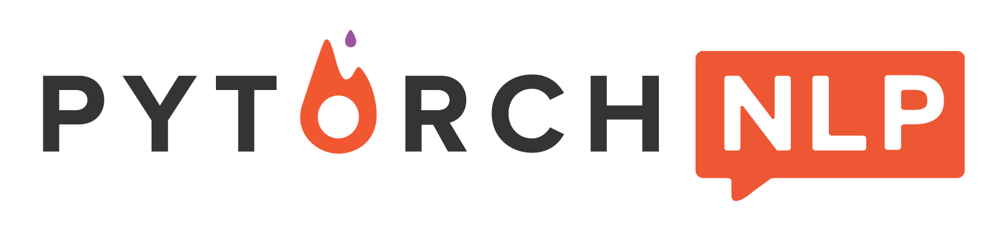

<p align="center"></p>

--------------------------------------------------------------------------------

PyTorch-NLP is a library for Natural Language Processing (NLP) in Python. It's built with the very
latest research in mind and was designed from day one to support rapid prototyping. PyTorch-NLP
comes with pre-trained embeddings, samplers, dataset loaders, metrics, neural network modules
and text encoders. It's open-source software, released under the BSD3 license. 


[](https://codecov.io/gh/PetrochukM/PyTorch-NLP) 
[](http://pytorchnlp.readthedocs.io/en/latest/?badge=latest)
[](https://travis-ci.org/PetrochukM/PyTorch-NLP)
[](https://gitter.im/PyTorch-NLP)

## Usage

- Load FastText, state-of-the-art English **word vectors**.

    ```python
    from torchnlp.embeddings import FastText
    vectors = FastText()
    vectors['hello']  # [torch.FloatTensor of size 100]
    ```

- Load **datasets** like IMDB.

    ```python
    from torchnlp.datasets import imdb_dataset
    train = imdb_dataset(train=True)
    train[0]  # {'text': 'For a movie that gets..', 'sentiment': 'pos'}
    ```

- Compute the BLEU Score with `torchnlp.metrics`.

    ```python
    from torchnlp.metrics import get_moses_multi_bleu
    hypotheses = ["The brown fox jumps over the dog 笑"]
    references = ["The quick brown fox jumps over the lazy dog 笑"]
    get_moses_multi_bleu(hypotheses, references, lowercase=True)  # 47.9
    ```

## Documentation 📖 

The complete documentation for PyTorch-NLP is available via [our ReadTheDocs website](https://pytorchnlp.readthedocs.io).

## Installation

Make sure you have Python 3.5+ and PyTorch 0.2.0 or newer. You can then install `pytorch-nlp` using
pip:

    pip install pytorch-nlp

### Optional requirements

If you want to use English tokenizer from `SpaCy <http://spacy.io/>`, you need to install SpaCy and download its English model:

    pip install spacy
    python -m spacy download en_core_web_sm

Alternatively, you might want to use Moses tokenizer from `NLTK <http://nltk.org/>`. You have to install NLTK and download the data needed:

    pip install nltk
    python -m nltk.downloader perluniprops nonbreaking_prefixes

## Contributing

We've released PyTorch-NLP because we found a lack of basic toolkits for NLP in PyTorch. We hope that other organizations can benefit from the project. We are thankful for any contributions from the community.

### Contributing Guide

Read our [contributing guide](https://github.com/PetrochukM/PyTorch-NLP/blob/master/Contributing.md) to learn about our development process, how to propose bugfixes and improvements, and how to build and test your changes to PyTorch-NLP.

## Logo Credits

Thanks to [Chloe Yeo](http://www.yeochloe.com/) for her logo design.
